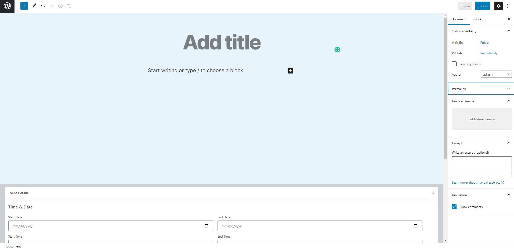
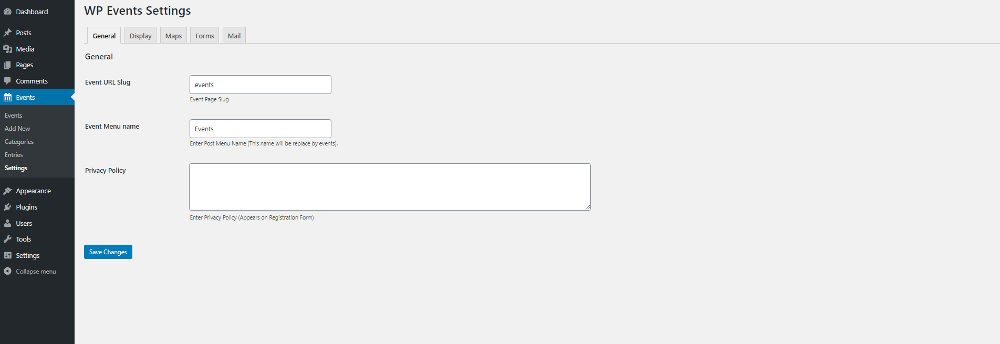
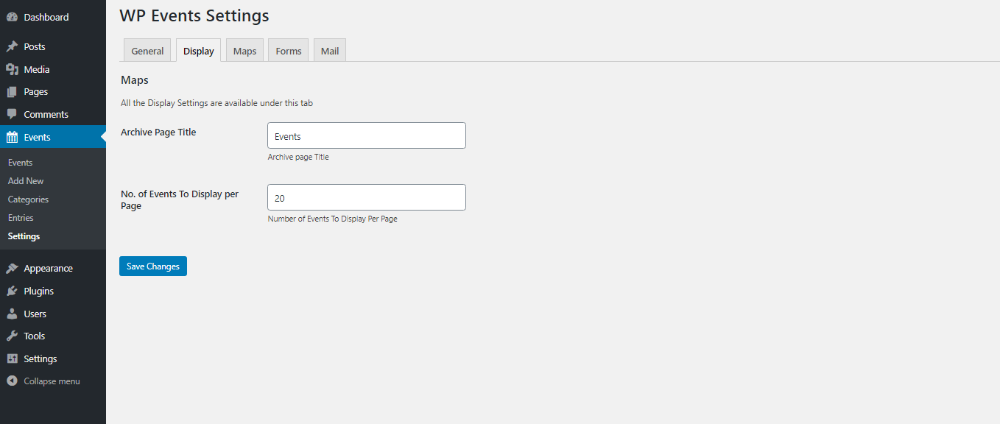
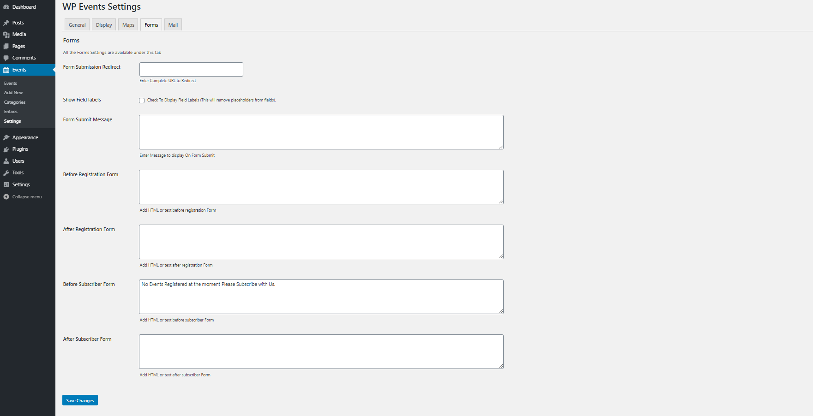
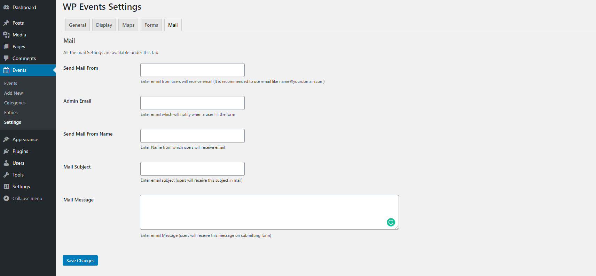
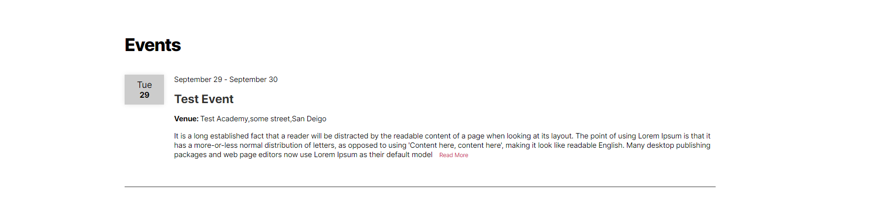
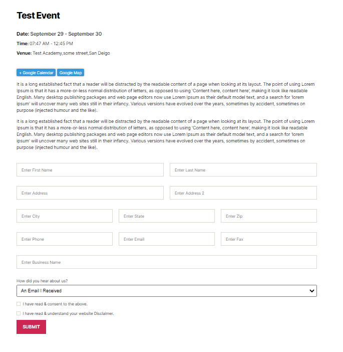

# WP Events
Contributors: (this should be a list of wordpress.org userid's) 
Donate link: //allmarketingsolutions.co.uk 
Tags: events, seminars, comments, calendar 
Requires at least: 5.1 
Tested up to: 5.5.1 
Stable tag: 5.1 
License: GPLv2 or later 
License URI: http://www.gnu.org/licenses/gpl-2.0.html

**A simple and lightweight WordPress plugin to create events and allow users to register to them.**

## Description

Easily create and manage events on your website using WP Events, whether it's a on site or virtual event you can create it easily, this plugin handles all your event hurdles for you and our team of elite engineers made sure it's simple, fast and reliable.

WP Events is build by AMS team and packed with all the features to kick off events on your website and WP Events is simple, reliable, and easily customizable.

## ✨ Features

WP Events is packed with a lot of features some highlighted are.

✔️ Easily create events 
✔️ Block Editor support 
✔️ Custom Menu labels 
✔️ Custom Page Slug 
✔️ Template Overriding 
✔️ Events Taxonomies (Categories & Tags) 
✔️ Add event to Google Calendar 
✔️ Completely responsive from mobile to tablet to desktop 
✔️ Custom HTML Email temaplates 
✔️ Hooks & filters for Customization 

##Installation

Installing the plugin is easy. Just follow one of the following methods:

[comment]: <> (###Install The Wp Events from within WordPress)

[comment]: <> (1. Visit the plugins page within your dashboard and select ‘Add New’)

[comment]: <> (2. Search for “WP Events”)

[comment]: <> (3. Activate The WP Events from your Plugins page)

[comment]: <> (4. You're done!)

###Install The WP Events Manually

1. From the dashboard of your site, navigate to Plugins --> Add New.
2. Select the Upload option and hit "Choose File."
3. When the popup appears select the wp-events.zip file from your desktop.
4. Follow the on-screen instructions and wait as the upload completes.
5. When it's finished, activate the plugin via the prompt. A message will show confirming activation was successful.

That's it! Just configure your settings as you see fit.

##Screenshots

##📃 Documentation

All of our documentation can be found in .

Additional helpful links:

##Changelog
###Version 1.0.2
Added:   WP Events Archive template added to select from Page Attributes 
Added:   priority set to high for custom meta fields 
Added:   a new file added in inlcudes/wp-events-global-functions.php to add global functions 
Added:   Global function "wpevent_date_time()" added to convert UNIX timestamp meta(event start/end date-time) to an associative array 
Added:   Single Template can be over ride in theme 
Added:   Last name Field aded in subscriber form 
Updated: Subscriber Form Username changed to First name 
Updated: wpevent-start-date & wpevent-start-time meta fields with wpevent-start-date-time 
Updated: wpevent-end-date & wpevent-end-time meta fields with wpevent-end-date-time 
Updated: updated $_POST to filter_input( INPUT_POST ) in class-wp-events-admin.php 
Updated: date format ( dd-mm-yy ) in jquery date picker change to yy-mm-dd 
Updated: meta query added to archive/taxonomy query 
Updated: number in shortcode set to posts_per_page 
Fixed:   Empty Archive title displays blank h1 
Fixed:   posts_per_page overrides posts number on the whole website 
Fixed:   pagination page/2 going to 404 
Fixed:   subscriber form redirects to archive page by default now redirect to the requested page 
Removed: default title "Events" removed from settings->display->Archive Page Title 
Removed: is_past_event() function removed from class-wp-events-public.php 

###Version 1.0.1
Added: * added to required checkboxes. 
Fixed: subscriber email field type changed from text to email

###Version 1.0.0
Added: Separate Email Templates for Subscriber And Registerer 
Added: Default Message Added for Email Templates 
Added: Subscriber Form Redirect Added 
Fixed: Email shortcodes emitting plain text. 
